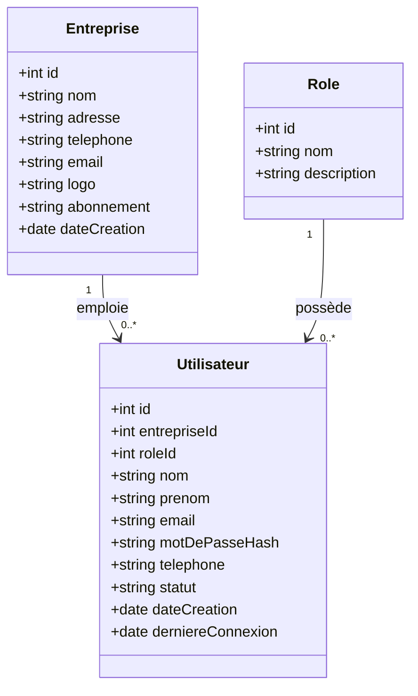
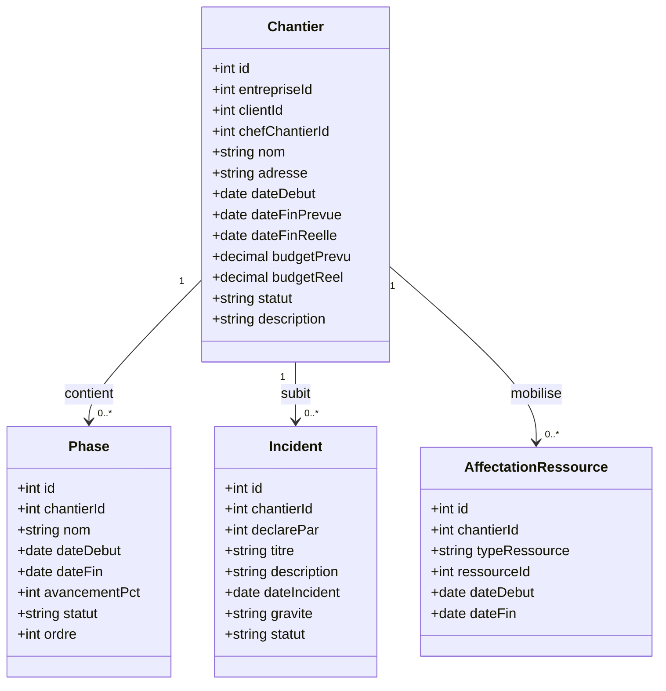
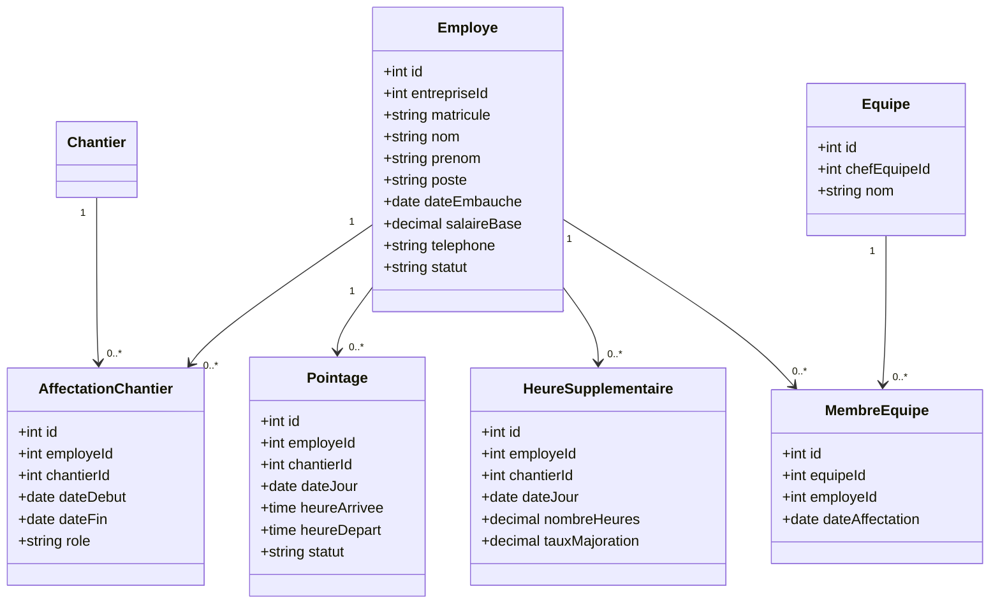
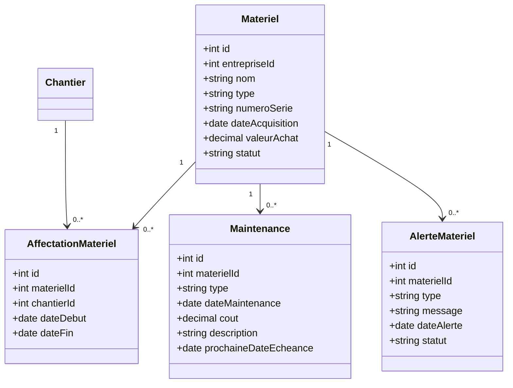
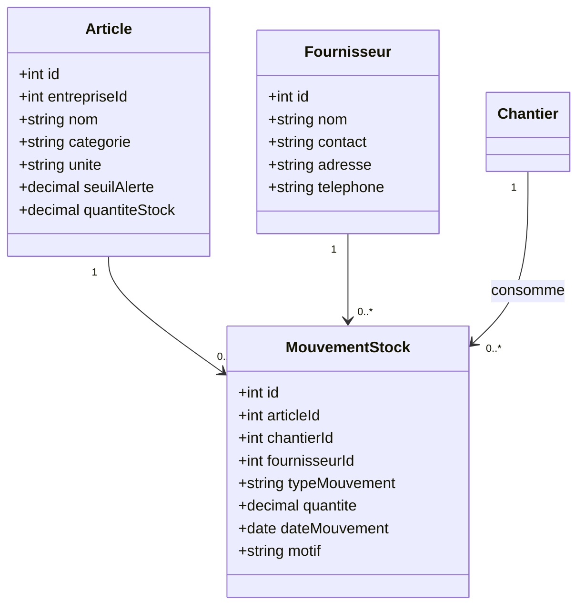
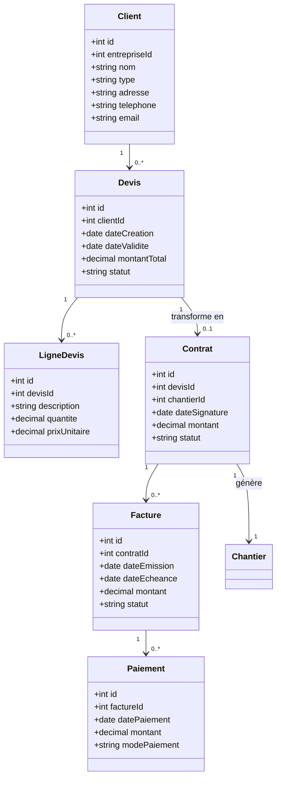
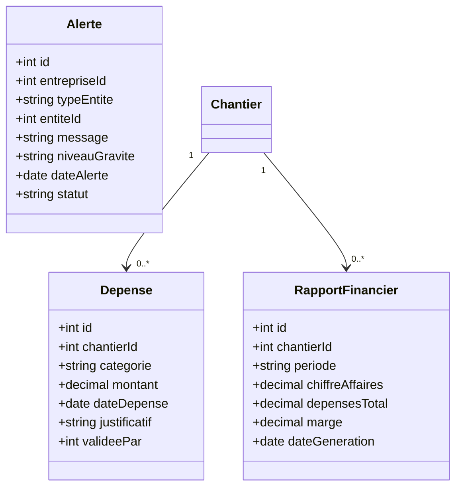
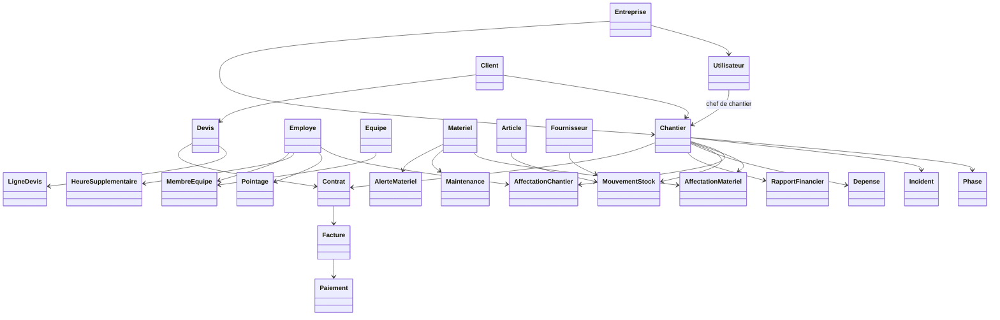

# TIA INFO BUILD — Conception de la Base de Données
## Diagrammes de Classe UML par Module

> Convention : les diagrammes sont découpés par module fonctionnel pour rester lisibles, puis reliés entre eux dans le schéma global en fin de document. Types de données pensés pour une implémentation MySQL/PDO (cohérent avec tes autres projets PHP).

---

## 0. Module Transverse — Utilisateurs, Rôles & Entreprise (multi-tenant SaaS)

Comme TIA INFO BUILD est un SaaS, chaque entreprise cliente doit être isolée (multi-tenant). Tout objet métier est rattaché, directement ou indirectement, à une `Entreprise`.

**Rôles typiques** : Administrateur, Directeur, Chef de chantier, Comptable/Gestionnaire, Magasinier, Employé de terrain.

---

## 1. Module Gestion des Chantiers (cœur du système)

`AffectationRessource` est une table pivot générique (`typeRessource` = "Employe" | "Materiel") qui pointe vers `ressourceId`. Alternative plus stricte : une table dédiée par type de ressource (voir modules 2 et 3) — recommandé si tu veux garder l'intégrité référentielle (FK propres), la table générique est plus flexible mais moins "propre" en SQL classique.

---

## 2. Module Ressources Humaines

---

## 3. Module Gestion des Matériels

---

## 4. Module Gestion des Stocks

`typeMouvement` = "Entree" | "Sortie". La consommation par chantier se déduit simplement des sorties filtrées par `chantierId`.

---

## 5. Module Commercial

---

## 6. Module Finance & Aide à la Décision

`Alerte` est une table générique transverse (dépassement budgétaire, rupture de stock, matériel en panne, retard de phase...) via `typeEntite` + `entiteId`, utilisée pour alimenter le tableau de bord.

---

## Schéma Relationnel Global (vue d'ensemble simplifiée)

---

## Notes de conception

- **Multi-tenant** : chaque table racine (Chantier, Employe, Materiel, Article, Client) porte `entrepriseId` pour cloisonner les données entre entreprises clientes du SaaS.
- **Soft delete recommandé** : ajouter un champ `estArchive` ou `dateSuppression` plutôt que des suppressions physiques, vu le besoin de traçabilité mentionné dans le cahier des charges.
- **Horodatage** : ajouter systématiquement `createdAt` / `updatedAt` sur toutes les tables (bonne pratique PDO/MySQL).
- **Prochaine étape naturelle** : passer de ce Modèle de classes → Modèle Logique (tables + clés étrangères + contraintes) → script SQL `CREATE TABLE`. Dis-moi si tu veux qu'on enchaîne directement sur le script SQL MySQL, ou si tu veux d'abord qu'on ajuste certaines entités (ex: gestion de la TVA sur les factures, gestion des sous-traitants, etc.).
